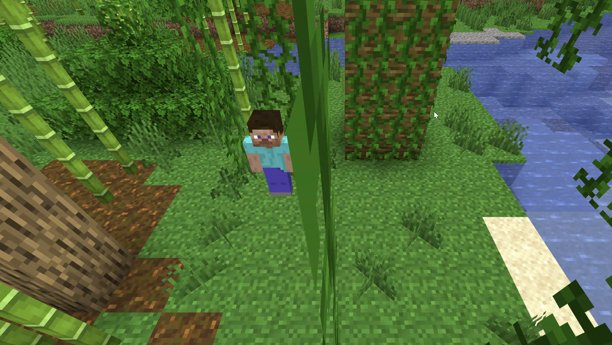
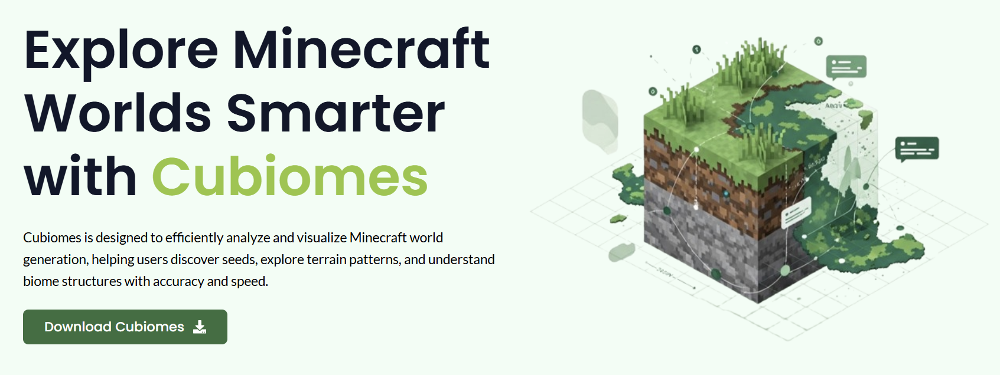
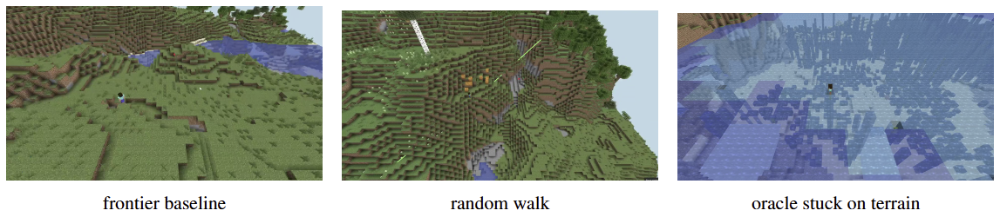
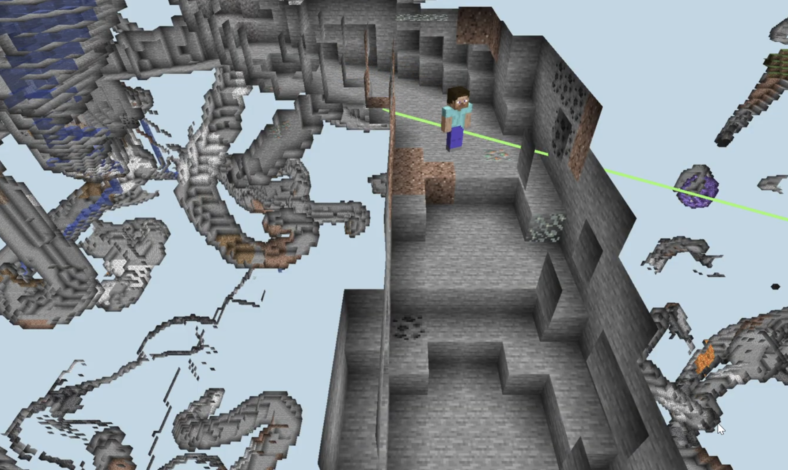

# CS221: Biome Coverage in Minecraft



Train a Minecraft agent to visit as many distinct biomes as possible in a
10-minute time budget. Linear-Q RL against a random walk and a frontier
baseline, with an offline max-coverage oracle as the upper bound.

## World model

The MDP discretizes the world into a 2D grid where **each cell is a 4×4
block square** — the unit Minecraft 1.18+ uses to store biomes natively.
Two cells are "the same biome" iff their biome ids match, so visit
counting and frontier reasoning happen at this resolution.

Actions are **8 compass directions × a fixed hop distance** (default
50 blocks for closed-loop policies; variable for the oracle). Block-level
locomotion (jumping, swimming, climbing, block-placing, block-digging)
is delegated to `mineflayer-pathfinder`; the agent never reasons below
the 4×4 cell level. Arrival is `GoalNearXZ(range=8)` by default
(tunable via `GOAL_TOLERANCE`) and `stuck=true` only when pathfinding
actually fails or times out (timeout scales with distance: `10s + 0.47s
× hop_distance`).

Two world settings, per proposal §2:

- **complete** (default): grid comes from an offline biome dump
  generated by cubiomes from the world seed. Same data the oracle
  plans on, so no train/eval drift.
- **los**: bridge ships its loaded-chunk grid live, with a `visible()`
  predicate hook for line-of-sight filtering (stub today).

## Setup (one-time)

### 1. Java

```bash
brew install --cask temurin              # macOS; or Adoptium Temurin 21 on Windows
java -version                            # expect 21.x
```

`mc-server/` ships pre-configured (eula.txt, server.properties, all Paper
YAMLs) except for the server binary itself, which is a third-party download
not redistributed here:

```bash
# PaperMC 1.20.1, build 196 (the version this project was developed against)
curl -o mc-server/paper.jar \
  https://api.papermc.io/v2/projects/paper/versions/1.20.1/builds/196/downloads/paper-1.20.1-196.jar
```

Any recent 1.20.1 Paper build works; pin build 196 to match the original
runs exactly. The only field you change per experiment is `level-seed=<N>`
in `mc-server/server.properties` — Paper reads it once at world creation, so
changing it requires a server restart.

### 2. Node deps

```bash
brew install node@20                     # or Node 20 LTS MSI on Windows
npm install                              # mineflayer, pathfinder, vec3
```

### 3. Python deps

```bash
brew install python@3.11                 # or python.org installer on Windows
python3 -m venv .venv && source .venv/bin/activate
pip install -r requirements.txt          # numpy, pytest
```

### 4. Cubiomes (vendored)


The offline biome generator is the upstream `cubiomes` C library, built
locally and loaded via ctypes.

```bash
git clone https://github.com/Cubitect/cubiomes tools/cubiomes
cd tools/cubiomes
make CFLAGS='-O3 -fPIC -Wall'
clang -dynamiclib -o libcubiomes.dylib *.o     # Linux: gcc -shared -o libcubiomes.so *.o
```

Verify:

```bash
python3 -c "from mdp.biomegen import cubiomes_gen; print(cubiomes_gen(1111)(0, 0))"
```

Should print a biome id.

## Pre-compute biome dumps (once per seed)

The oracle and the agent's complete-knowledge view both read from
`data/biomes_<seed>.npz`. Build them once:

```bash
python3 tools/extract_biomes.py --seed 1111
# repeat per seed; takes ~1 s each at the default ±1024-block radius
```

## Running an episode


Three terminals.

**Terminal 1 — Paper server** (set `level-seed=<seed>` in
`server.properties` first; PaperMC reads it only at world creation):

```bash
cd mc-server && java -Xmx6G -Xms2G -jar paper.jar nogui
```

Wait for `Done!`.

**Terminal 2 — bot bridges** (one process per bot, ports 9000+id):

```bash
node bot/spawn.js 10        # 10 bots, staggered 2s apart
# or for a single bot: node bot/bridge.js 0
```

For line-of-sight experiments, prepend `WORLD_MODE=los`.

**Terminal 3 — eval**:

```bash
python3 eval.py --policy random   --seed 1111 --episode 0
python3 eval.py --policy frontier --seed 1111 --episode 1
python3 eval.py --policy oracle   --seed 1111 --episode 2 --radius 64
```

### Full test-eval (45 episodes, ~30 min, cross-platform)


```bash
for s in 123 456 789; do python3 tools/extract_biomes.py --seed $s; done
python3 tools/run_test_eval.py
```

Stages one Paper server per test seed (ports 25565..25567), spawns 5
bot bridges per server, then runs random → frontier → oracle across all
15 bots in parallel. Wall-clock ≈ one episode budget (10 min) per
policy. Cleans up servers + bots on exit / Ctrl-C. Works on macOS,
Linux, Windows.

Per-episode metrics land in `results/<policy>_<seed>_<ep>.json` (primary:
`unique_biomes`; plus `biomes_per_action`, `position_entropy`,
`position_coverage`, `biome_entropy`). See proposal §3.

Defaults: `--budget-s 600`, `--mode complete`, `--bot-id 0`.

## Tests

```bash
python3 -m pytest tests/
```

Smoke-test locomotion end-to-end (requires server + at least one bot):

```bash
python3 tools/smoke_locomotion.py --id 0
```

## Layout

```
mdp/                   Python: env, world view, biome generator, policies
  env.py               TCP client to a bot bridge, action space, view overlay
  world.py             NpzWorldView (slices data/biomes_<seed>.npz)
  biomegen.py          cubiomes_gen(seed) → (cell_x, cell_z) → biome_id
  baselines.py         RandomPolicy, FrontierPolicy (sector-vote variants)
  features.py          Linear-Q feature extractor (φ ∈ ℝ²⁷)
  qlearn.py            Q-learning + potential-based shaping + count bonus
  oracle.py            Offline greedy orienteering planner
  oracle_cluster.py    Cluster-then-route planner variant
  oracle_lookahead.py  Lookahead planner variant
bot/                   Node: mineflayer bridge + spawner
tools/                 Utility scripts; tools/cubiomes/ vendored, gitignored
  extract_biomes.py    Materializer: cubiomes → data/biomes_<seed>.npz
  smoke_locomotion.py  Interactive smoke test (not pytest)
  drive_demo.py        Drive a bridge bot through compass hops (viewer demo)
tests/                 pytest
mc-server/             PaperMC install; world data gitignored
eval.py                One-episode orchestrator
seeds.txt              Train (10) / test (3) seed split
```

## Ports

- `25565` — Minecraft server
- `9000`–`9009` — one per bot bridge (up to 10 bots)

## Results

**Final hierarchy** (v42, n=25 per policy, 5 test seeds `{11111, 22222, 33333, 44444, 55555}`, 600s budget, `tol=8`, `hop=50`, stuck-escape both train+eval, online-replanning oracle):

| Method                       | ub mean | sd   | max | Hyperparameters / Notes                                                                                            |
|------------------------------|---------|------|-----|--------------------------------------------------------------------------------------------------------------------|
| oracle (planned)             | 8.44    | 2.47 | 14  | offline plan upper bound (no execution); `ORACLE_RADIUS=64` cells, `ORACLE_INTERIOR=2`                             |
| oracle (executed)            | **5.44**| —    | —   | hop=variable (4–500+), tol=8, `ORACLE_INTERIOR=2`, online replanning, no stuck-escape (replan handles it)          |
| qlearn (PHI=19, 22 rounds)   | 4.44    | 2.04 | 10  | α=0.05, γ=0.95, ε=0.05, hop=50, tol=8; φ ∈ ℝ¹⁹ (closeness ×8, count ×8, visited_progress, was_stuck, bias)         |
| frontier_sector_penalty      | 3.64    | 1.41 | 6   | 8-sector vote (novel cells − visited-cells per wedge), random tie-break, hop=50, tol=8, eval-time stuck-escape     |
| random                       | 3.44    | 1.19 | 5   | uniform `random{0..7}`, hop=50, tol=8, eval-time stuck-escape (no-op, already random)                              |

**Statistical significance** (vs random, two-sample z, n=25 each):

- qlearn: Δ=+1.00, SE=0.47, z=2.13, one-sided p≈0.017
- oracle (executed): Δ=+2.00, SE=0.50, z=4.0, p<0.001
- frontier: Δ=+0.20, SE=0.36, z=0.55, p≈0.29 (not significant)

**See [`RESULTS.md`](RESULTS.md)** for the 19-iteration journey, what each change moved by how much, and open headroom.

### Reproduce

```bash
# Test eval (4 policies, ~70 min on a 64GB Mac)
RESTART_SERVERS=1 GOAL_TOLERANCE=8 ORACLE_INTERIOR=2 \
SEEDS=11111,22222,33333,44444,55555 SEED_INSTANCES=1 \
  python3 tools/run_test_eval.py \
  --policies random,frontier_sector_penalty,qlearn,oracle \
  --budget-s 600

# Train qlearn from scratch (5 seeds × 24 rounds, ~2 hours)
GOAL_TOLERANCE=8 HOP_DISTANCE=50 \
  python3 train.py --seeds 1111,2222,3333,4444,5555 \
    --episodes-per-seed 24 --budget-s 300 --fresh
```

### Configurable env vars

| Var                     | Default | What it does                                              |
|-------------------------|---------|-----------------------------------------------------------|
| `GOAL_TOLERANCE`        | 16      | Pathfinder `GoalNearXZ` arrival radius (blocks)           |
| `ORACLE_INTERIOR`       | 4       | Oracle target cell depth inside biome region (cells)      |
| `HOP_DISTANCE`          | 50      | Hop distance for in-game policies (blocks)                |
| `SETTLE_S`              | 90      | Bot dispersal settle time before eval starts (seconds)    |
| `RESTART_SERVERS`       | 0       | Restart MC servers between policies (fresh JVM heap)      |
| `JVM_XMX` / `JVM_XMS`   | 6G / 2G | MC server JVM heap                                        |
| `STUCK_ESCAPE_STREAK`   | 1       | Stuck count before forcing random action (999 = disabled) |
| `SEED_INSTANCES`        | 1       | Number of duplicate-seed servers per seed                 |
| `SEEDS`                 | 123,456,789 | Comma-separated test seeds for the driver             |
| `VIEWER`                | 0       | `1` = serve a prismarine-viewer 3D web view of the bot     |
| `VIEWER_BASE_PORT`      | 3000    | Viewer HTTP port is `VIEWER_BASE_PORT + bot_id`           |
| `VIEWER_FIRST_PERSON`   | 0       | `1` = bot's-eye view instead of orbit-follow              |

## Live 3D viewer (for figures / demos)



`prismarine-viewer` renders a headless 3D web view of a bot — no second
Minecraft client needed. It's opt-in (off in the eval fleet) and draws
the bot's traversed path as a polyline plus the current pathfinder target
as a marker, which is what you want for a trajectory figure.

```bash
# Terminal 1: server (as above)        cd mc-server && java -Xmx6G -Xms2G -jar paper.jar nogui
# Terminal 2: one viewer-enabled bot
VIEWER=1 node bot/bridge.js 0          # serves http://localhost:3000, opens bridge on 9000
# Terminal 3: make it move so the trail is non-trivial — either run an
# eval against port 9000, or use the standalone driver:
python3 tools/drive_demo.py 14         # 14 compass hops; pass [n_hops] [port]
```

Open `http://localhost:3000` after the bot spawns: the orbit camera follows
the bot, the green polyline is its traversed path, and the red marker is the
current pathfinder target. A freshly spawned bot just sits at its dispersal
point until something drives it (eval or `drive_demo.py`), so start the
driver before recording.

Each bot gets its own port (`3000 + id`), so `VIEWER=1 node bot/spawn.js 5`
exposes bots 0–4 on ports 3000–3004. Point a screen recorder at the tab
for a demo clip, or grab stills for the paper. Leave `VIEWER` unset for
batch eval runs — one WebGL server per bot across 25 bots is a needless
perf hit.

Note: bots occasionally die mid-run with `entity-position-NaN` (a known
mineflayer locomotion bug, see `RESULTS.md` §5.3); the viewer stops tracking
when the underlying bot dies. Just relaunch the bridge.

`prismarine-viewer` pulls in `canvas` (a native module). `npm install`
fetches a prebuilt binary on most platforms; if a build is triggered on
Linux you may need `apt install libcairo2-dev libpango1.0-dev libjpeg-dev
libgif-dev librsvg2-dev` first. The viewer is `require`d lazily, so this
only matters when `VIEWER=1`.

## Acknowledgements

This project stands on several open-source tools, none of which are
redistributed here — install them as described above:

- [PaperMC](https://papermc.io/) — the Minecraft server (`paper.jar`)
- [mineflayer](https://github.com/PrismarineJS/mineflayer) and
  [mineflayer-pathfinder](https://github.com/PrismarineJS/mineflayer-pathfinder)
  — bot control and block-level locomotion
- [cubiomes](https://github.com/Cubitect/cubiomes) — offline biome
  generation from a world seed
- [prismarine-viewer](https://github.com/PrismarineJS/prismarine-viewer)
  — the optional 3D web view

Developed as a CS221 (Artificial Intelligence) final project at Stanford.

## License

Released under the [MIT License](LICENSE). Note that the third-party tools
listed above carry their own licenses, and Minecraft itself is proprietary
to Mojang/Microsoft — this repository contains none of their code or assets.
